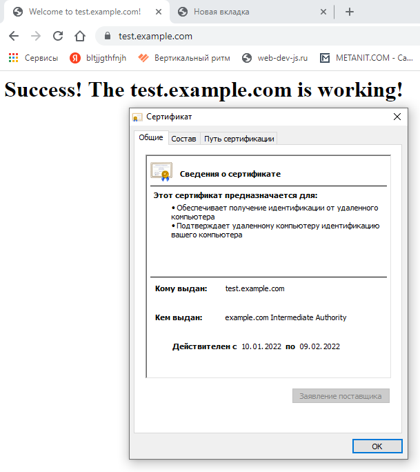

# Курсовая работа по итогам модуля "DevOps и системное администрирование"

### 1. Процесс установки и настройки ufw

UFW уже установлен в Ubuntu 20.04 server.

```shell
dmitry@ubuntu-server:~$ ufw version
ufw 0.36
```

Установим правила UFW по умолчанию, запретим все входящие и разрешим все исходящие:

```sh
dmitry@ubuntu-server:~$ sudo ufw default deny incoming
dmitry@ubuntu-server:~$ sudo ufw default allow outgoing
```

Далее откроем 22 и 443 порты:

```shell
dmitry@ubuntu-server:~$ sudo ufw allow 22
dmitry@ubuntu-server:~$ sudo ufw allow 443
```
Включаем ufw: 
```shell
dmitry@ubuntu-server:~$ sudo ufw enable
```

Разрешим трафик для интерфейса lo на все порты: 

```shell
dmitry@ubuntu-server:~$ sudo ufw allow in on lo
```

Результат: 
```shell
dmitry@ubuntu-server:~$ sudo ufw status
Status: active

To                         Action      From
--                         ------      ----
22                         ALLOW       Anywhere                  
443                        ALLOW       Anywhere                  
Anywhere on lo             ALLOW       Anywhere                  
22 (v6)                    ALLOW       Anywhere (v6)             
443 (v6)                   ALLOW       Anywhere (v6)             
Anywhere (v6) on lo        ALLOW       Anywhere (v6) 
```


### 2. Процесс установки и выпуска сертификата с помощью hashicorp vault

Устанавливаем vault:
```shell
dmitry@ubuntu-server:~$ curl -fsSL https://apt.releases.hashicorp.com/gpg | sudo apt-key add -
OK
dmitry@ubuntu-server:~$ sudo apt-add-repository "deb [arch=amd64] https://apt.releases.hashicorp.com $(lsb_release -cs) main"

dmitry@ubuntu-server:~$ sudo apt-get update && sudo apt-get install vault

```

Разрешаем автозапуск службы и если она не запущена, стартуем ее:
```shell
dmitry@ubuntu-server:~$ sudo systemctl enable vault --now
Created symlink /etc/systemd/system/multi-user.target.wants/vault.service → /lib/systemd/system/vault.service
```

#### Настроим рабочее окружение

Будем подключаться к vault по http.
Раскоментируем строки в файле vault.hcl:

```shell
# HTTP listener
listener "tcp" {
  address = "127.0.0.1:8200"
  tls_disable = 1
}
```
Закомметируем 
```shell
# HTTPS listener
#listener "tcp" {
 # address       = "0.0.0.0:8200"
  #tls_cert_file = "/opt/vault/tls/tls.crt"
  #tls_key_file  = "/opt/vault/tls/tls.key"
#}
```

Перезапустим службу vault
```shell
dmitry@ubuntu-server:~$ sudo systemctl restart vault
```
Запишем системную переменную VAULT_ADDR=http://127.0.0.1:8200 в файл, чтобы она создавалась каждый раз при входе в систему
```shell
dmitry@ubuntu-server:~$ sudo nano /etc/environment 
```

Создадим автоматическое распечатывание vault: 
```shell
dmitry@ubuntu-server:~$ vault operator init
Unseal Key 1: DGFRnvt/LKcbHokCdpvKlZF/CLocHRikIICVay9CNI3e
Unseal Key 2: fKQ4/W2X9UF+epg2l0MJV+sGBgRPO0T6Kb8wJqFsId2S
Unseal Key 3: hDrs4KvpVHySjsSlhUgPenXK+B+BfnlSfhIbDfDnQxn2
Unseal Key 4: QFQn7llR4W/4v0hnYAQyX4roQPB+XSiVcTidhjxxSYAs
Unseal Key 5: GaqT8b/t1uwMAcAoo1JSpOxCmB6rNHBFf3VMqRmmBhUJ
```
Создадим каталог для хранения скриптов:

```shell
dmitry@ubuntu-server:~$ sudo mkdir /scripts
```
Создадим скрипт 
```shell
#!/bin/bash
PATH=/etc:/bin:/sbin:/usr/bin:/usr/sbin:/usr/local/bin:/usr/local/sbin

sleep 10
vault operator unseal DGFRnvt/LKcbHokCdpvKlZF/CLocHRikIICVay9CNI3e
vault operator unseal fKQ4/W2X9UF+epg2l0MJV+sGBgRPO0T6Kb8wJqFsId2S
vault operator unseal hDrs4KvpVHySjsSlhUgPenXK+B+BfnlSfhIbDfDnQxn2
```

Разрешаем запуск скрипта на выполнение

```shell
dmitry@ubuntu-server:~$ sudo chmod +x /scripts/unseal.sh 
```
Выполним скрипт 
```shell
dmitry@ubuntu-server:~$ /scripts/unseal.sh
```
В результате получим распечатанный сервер
```shell
Key             Value
---             -----
Seal Type       shamir
Initialized     true
Sealed          false
Total Shares    5
Threshold       3
Version         1.9.2
Storage Type    file
Cluster Name    vault-cluster-bff3bf90
Cluster ID      08df0907-1c07-a909-94e9-0d56c337890b
HA Enabled      false
```

Создадим автозапуcк скрипта при старте сервера. 

Создаем юнит 
```shell
dmitry@ubuntu-server:~$ sudo nano /etc/systemd/system/vault-unseal.service

[Unit]
Description=Vault Auto Unseal Service
After=network.target
After=vault.service

[Service]
Environment="VAULT_ADDR=http://127.0.0.1:8200"
ExecStart=/scripts/unseal.sh
Type=oneshot
RemainAfterExit=no

[Install]
WantedBy=multi-user.target
```

Перечитаем конфигурацию для systemd:
```shell
dmitry@ubuntu-server:~$ sudo systemctl daemon-reload
```
Разрешаем автозапуск созданного сервиса:

```shell
dmitry@ubuntu-server:~$ sudo systemctl enable vault-unseal
Created symlink /etc/systemd/system/multi-user.target.wants/vault-unseal.service → /etc/systemd/system/vault-unseal.service.
```

Теперь после перезагрузки сервера vault окажется распечатанным

Доустанавливаем в систему утилиту «jq»
```shell
dmitry@ubuntu-server:~$ sudo apt install jq
```

Авторизуемся в vault

```shell
dmitry@ubuntu-server:~$ vault login  s.0lwZ7veroWS3LUaCA4XAPbza
```   

1) Создаем корневой центр сертификации (ЦС)

```shell
dmitry@ubuntu-server:~$ vault secrets enable pki
Success! Enabled the pki secrets engine at: pki/
dmitry@ubuntu-server:~$ vault secrets tune -max-lease-ttl=87600h pki
Success! Tuned the secrets engine at: pki/
dmitry@ubuntu-server:~$ vault write -field=certificate pki/root/generate/internal \
>      common_name="example.com" \
>      ttl=87600h > CA_cert.crt

dmitry@ubuntu-server:~$ vault write pki/config/urls \
>      issuing_certificates="http://127.0.0.1:8200/v1/pki/ca" \
>      crl_distribution_points="http://127.0.0.1:8200/v1/pki/crl"
Success! Data written to: pki/config/urls
```
CA_cert.crt - добавим в доверенные сертификаты на хостовой машине.

2) Создаем промежуточный ЦС
```shell
dmitry@ubuntu-server:~$ vault secrets enable -path=pki_int pki
Success! Enabled the pki secrets engine at: pki_int/
dmitry@ubuntu-server:~$ vault secrets tune -max-lease-ttl=43800h pki_int
Success! Tuned the secrets engine at: pki_int/
dmitry@ubuntu-server:~$ vault write -format=json pki_int/intermediate/generate/internal \
>      common_name="example.com Intermediate Authority" \
>      | jq -r '.data.csr' > pki_intermediate.csr
dmitry@ubuntu-server:~$ vault write -format=json pki/root/sign-intermediate csr=@pki_intermediate.csr \
>      format=pem_bundle ttl="43800h" \
>      | jq -r '.data.certificate' > intermediate.cert.pem
dmitry@ubuntu-server:~$ vault write pki_int/intermediate/set-signed certificate=@intermediate.cert.pem
Success! Data written to: pki_int/intermediate/set-signed
```

3) Создаем роль 
```shell
dmitry@ubuntu-server:~$ vault write pki_int/roles/example-dot-com \
>      allowed_domains="example.com" \
>      allow_subdomains=true \
>      max_ttl="720h"
Success! Data written to: pki_int/roles/example-dot-com
```

4) Создаем сертификат на 30 дней для test.example.com
```shell
dmitry@ubuntu-server:~$ vault write -format=json pki_int/issue/example-dot-com common_name="test.example.com" ttl="720h" > test.example.com.crt
```

Сохраняем сертификат в правильном формате
```shell
dmitry@ubuntu-server:~$ cat test.example.com.crt | jq -r .data.certificate > test.example.com.crt.pem
dmitry@ubuntu-server:~$ cat test.example.com.crt | jq -r .data.issuing_ca >> test.example.com.crt.pem
dmitry@ubuntu-server:~$ cat test.example.com.crt | jq -r .data.private_key > test.example.com.crt.key
```

### 3.Процесс установки и настройки сервера nginx

```shell
dmitry@ubuntu-server:~$ sudo apt install nginx
```

Настроим блок сервера для нашего домена test.example.com 

```shell
dmitry@ubuntu-server:~$ sudo mkdir -p /var/www/test.example.com/html
dmitry@ubuntu-server:~$ sudo chmod -R 755 /var/www/test.example.com/
dmitry@ubuntu-server:~$ /var/www/test.example.com/html/index.html
dmitry@ubuntu-server:~$ sudo nano /etc/nginx/sites-available/test.example.com
```

Перенесем файлы сертификатов в папку /etc/ssl 
```shell
dmitry@ubuntu-server:~$ sudo mv test.example.com.crt.key /etc/ssl
dmitry@ubuntu-server:~$ sudo mv test.example.com.crt.pem /etc/ssl
```

Изменим конфигурацию nginx для test.example.com

```shell
server {
        listen              443 ssl;
        server_name test.example.com www.test.example.com;

        ssl_certificate     "/etc/ssl/test.example.com.crt.pem";
        ssl_certificate_key "/etc/ssl/test.example.com.crt.key";

        ssl_protocols       TLSv1 TLSv1.1 TLSv1.2;
        ssl_ciphers         HIGH:!aNULL:!MD5;

        root /var/www/test.example.com/html;
        index index.html index.htm index.nginx-debian.html;


        location / {
                try_files $uri $uri/ =404;
        }
}
```
Рестартуем nginx 

```shell
dmitry@ubuntu-server:~$ sudo nginx -t
nginx: the configuration file /etc/nginx/nginx.conf syntax is ok
nginx: configuration file /etc/nginx/nginx.conf test is successful

dmitry@ubuntu-server:~$ sudo systemctl restart nginx
```
Заходим на страницу test.example.com



Создаем скрипт для генерации сертификата 

```shell
dmitry@ubuntu-server:~$ sudo nano generate_sert
#!/usr/bin/env bash

vault write -format=json pki_int/issue/example-dot-com common_name="test.example.com" ttl="720h" > /home/dmitry/test.example.com.crt

cat /home/dmitry/test.example.com.crt | jq -r .data.certificate > /etc/ssl/test.example.com.crt.pem
cat /home/dmitry/test.example.com.crt | jq -r .data.issuing_ca >> /etc/ssl/test.example.com.crt.pem
cat /home/dmitry/test.example.com.crt | jq -r .data.private_key > /etc/ssl/test.example.com.crt.key

systemctl restart nginx.service
```

Для проверки в crontab поставим выполнения скрипта generate_sert каждую минуту
```shell
sudo crontab -e

* * * * * /home/dmitry/generate_sert
```
и в результате получим: 

```shell
Jan 10 16:57:01 ubuntu-server CRON[1917]: (root) CMD (/home/dmitry/generate_sert)
Jan 10 16:57:01 ubuntu-server systemd[1]: Stopping A high performance web server and a reverse proxy server...
Jan 10 16:57:01 ubuntu-server systemd[1]: nginx.service: Succeeded.
Jan 10 16:57:01 ubuntu-server systemd[1]: Stopped A high performance web server and a reverse proxy server.
Jan 10 16:57:01 ubuntu-server systemd[1]: Starting A high performance web server and a reverse proxy server...
Jan 10 16:57:01 ubuntu-server systemd[1]: Started A high performance web server and a reverse proxy server.
```

Настроим crontab, стобы он запуcкал скрипт один раз в месяц 10 числа в 03:30: 
```shell
sudo crontab -e

30 3 10 * * /home/dmitry/generate_sert
```
